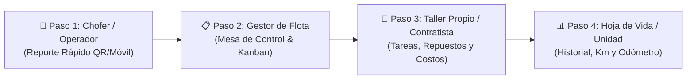

# 🚛 Manual de Diseño, Estilos y Arquitectura del Sistema de Mantenimiento de Flota (16 Camionetas)
> **La Martina — Documento de Referencia Técnica y Visual**  
> *Versión:* 1.0  
> *Ámbito:* Módulo de Gestión de Flota, Reportes de Choferes, Mesa de Programación, Taller Propio vs Contratistas y Hoja de Vida.

---

## 📌 1. Visión y Flujo Operativo del Sistema

El sistema resuelve la gestión integral de mantenimiento para una flota de **16 camionetas en uso continuo**, eliminando notas en papel y mensajes informales de WhatsApp.



---

## 🎨 2. Sistema de Diseño (Design System Tokens)

### 2.1 Paleta de Colores (Color Palette)

#### A. Fondos y Superficies Neutras
* **Canvas / Fondo General:** `#f8f9fa` (Gris claro neutro, evita cansancio visual).
* **Superficies de Tarjetas (Cards):** `#ffffff` (Blanco puro).
* **Bordes de Contorno:** `#e2e8f0` / `#cbd5e1` (Gris tenue, 1px sólido).
* **Header Principal / Barras Oscuras:** `#1e293b` (*Slate 800* - Azul noche institucional).
* **Header Formulario Chofer:** `#2c3e50` (*Midnight Navy*).
* **Sub-fondos y Agrupadores de Campos:** `#f1f5f9` (*Slate 100*).
* **Marco Celular (Simulador):** `#1e293b` (Borde sólido 12px con notch simulado).

#### B. Colores Semánticos por Etapa del Flujo
* 🔵 **Paso 1 (Chofer / Reporte):** `#0d6efd` | Fondo tenue: `#e7f1ff`
* 🟣 **Paso 2 (Gestor / Mesa de Control):** `#6f42c1` | Fondo tenue: `#f3e8ff`
* 🟠 **Paso 3 (Taller / Mecánico):** `#d97706` | Fondo tenue: `#fef3c7`
* 🟢 **Paso 4 (Hoja de Vida / Historial):** `#198754` | Fondo tenue: `#d1e7dd`

#### C. Semáforo de Urgencia y Estados de la Unidad
| Estado | Color Principal | Fondo Tenue (Badge / Alerta) | Significado Operativo |
| :--- | :--- | :--- | :--- |
| 🟢 **Operativa / Leve** | `#10b981` (Verde esmeralda) | `#d1fae5` / `#f0fdf4` | Unidad trabajando sin novedades críticas. |
| 🟡 **Requiere Turno / Programada** | `#f59e0b` (Ámbar / Amarillo) | `#fef9c3` / `#fef3c7` | Puede operar; turno fijado en los próximos días. |
| 🔴 **Inmovilizada / Crítico** | `#dc3545` (Rojo carmesí) | `#fee2e2` / `#f8d7da` | Unidad parada, no debe circular. |
| 🔧 **En Taller Actualmente** | `#d97706` (Naranja taller) | `#fef9c3` | En proceso de desarme o reparación activa. |

#### D. Origen de Repuestos y Talleres
* **Taller Propio (San Pablo / Berdina):** `#198754` (Verde) | Badge: `bg-success-subtle`
* **Contratista Externo:** `#0d6efd` (Azul) | Badge: `bg-primary-subtle`
* **Repuesto de Stock Propio:** Fondo `#d1e7dd`, Texto `#0f5132`, Borde `#198754`
* **Repuesto Provisto por Taller:** Fondo `#cfe2ff`, Texto `#084298`, Borde `#0d6efd`

---

### 2.2 Tipografía y Jerarquía de Textos

* **Fuente:** Sistema de alta legibilidad (`Segoe UI`, `-apple-system`, `Roboto`, `sans-serif`).
* **Jerarquía de Tamaños:**

| Rol del Texto | Tamaño (rem / px) | Peso (Font Weight) | Color | Aplicación |
| :--- | :--- | :--- | :--- | :--- |
| **Título Principal (Header)** | `1.25rem` (20px) | `700` (Bold) | `#ffffff` | Nombre del módulo y panel superior. |
| **Títulos de Sección (H4)** | `1.4rem` (22px) | `700` (Bold) | `#1e293b` | Títulos principales de cada paso. |
| **Subtítulos y Tarjetas (H5/H6)** | `1.05rem` (17px) | `600` / `700` | `#2c3e50` | Patentes, Modelo (`Toyota Hilux 4x4 DX`). |
| **Cuerpo General (Body)** | `0.93rem` (15px) | `400` (Regular) | `#334155` | Descripciones de fallas, tareas y notas. |
| **Subtextos y Metadatos** | `0.85rem` (13.5px) | `400` / `500` | `#64748b` (Muted) | Fechas, chofer informante, base habitual. |
| **Micro-etiquetas / Badges** | `0.68rem` – `0.78rem` | `600` / `700` | Blanco o Semántico | *"AF 102 CD"*, *"EN CURSO"*, *"Stock Propio"*. |
| **Números de Odómetro y Costos** | `1.5rem` – `2.0rem` | `700` (Bold) | `#1e293b` / `#10b981` | Km acumulados (`78.400 Km`), Totales `$`. |

---

### 2.3 Bordes Redondeados, Sombras y Espaciados

* **Radio de Bordes (Border Radius):**
  * Tarjetas estándar (`rounded-4`): `16px` a `20px`.
  * Botones y selects (`rounded-3`): `10px` a `12px`.
  * Badges y píldoras (`rounded-pill`): `50px`.
  * Marco de simulador celular: `36px`.
* **Sombras (Box Shadows):**
  * Sombra sutil de tarjetas: `0 4px 6px -1px rgba(0, 0, 0, 0.05)`.
  * Sombra elevada / hover: `0 10px 15px -3px rgba(0, 0, 0, 0.1)`.
  * Sombra flotante de celular: `0 25px 50px -12px rgba(0, 0, 0, 0.4)`.

---

## 🛠️ 3. Estructura de Componentes por Pantalla

### 📱 1. Paso 1 — Reporte Rápido de Chofer (`Paso1ReporteChofer.jsx`)
* **Simulador de Pantalla Celular:** Ancho de `420px` centrado con notch y borde `12px solid #1e293b`.
* **Selector Rápido de Camioneta:** Dropdown grande con interno, patente, modelo y odómetro anterior registrado.
* **Selectores de Urgencia en 3 Bloques:**
  * 🟢 *Detalle / Leve* (no bloqueante).
  * 🟡 *Requiere Turno* (atender esta semana).
  * 🔴 *Inmovilizada* (marca la unidad automáticamente como parada).
* **Chips de Categoría:** Botones redondeados (*Mecánica, Frenos, Luces, Neumáticos, Service, Carrocería*).
* **Atajos de Texto Rápido:** Píldoras clicables para autocompletar descripciones comunes (*"Ruido tren delantero"*, *"Pérdida de refrigerante"*).
* **Botón de Envío (CTA):** `#2c3e50`, padding grande `py-3`, `rounded-4`, texto blanco en negrita.

---

### 📋 2. Paso 2 — Mesa de Control & Kanban (`Paso2MesaProgramacion.jsx`)
* **4 Columnas del Tablero Kanban:**
  1. `1. Novedades Reportadas` (Fondo `#f1f5f9`, borde `#e2e8f0`, franja izquierda según urgencia).
  2. `2. Programadas / Con Turno` (Fondo `#f1f5f9`, franja lateral azul `#0d6efd`).
  3. `3. En Taller / Reparación` (Fondo cálido `#fef9c3`, franja ámbar `#d97706`, badge *"EN CURSO"*).
  4. `4. Finalizadas Recientes` (Fondo menta `#f0fdf4`, franja verde `#16a34a`).
* **Modal de Programación (Crear OT):**
  * Selector agrupado de talleres:
    * 🏠 **Talleres Propios:** *Taller Base San Pablo*, *Taller Base Berdina*.
    * 🏢 **Contratistas Externos:** *Taller Diésel Norte*, *Gomería Central*, *Taller Oficial Toyota*, *Electromecánica El Rayo*, *Chapa y Pintura La Cumbre*.
  * Selector de fecha de turno, tipo (Preventivo / Correctivo / Mejora), mecánico y presupuesto estimado.

---

### 🔧 3. Paso 3 — Asiento de Taller y Repuestos (`Paso3AsentarTaller.jsx`)
* **Ficha Lateral de la OT:** Datos de la unidad, taller asignado, motivo original y caja de liquidación financiera en vivo.
* **Checklist Dinámico de Tareas:**
  * Ítems no completados: fondo blanco con checkbox.
  * Ítems completados: fondo verde tenue `#d1e7dd` con texto en negrita.
  * Input rápido para añadir tareas manuales.
* **Tabla de Repuestos y Consumibles:**
  * Columnas: *Descripción, Cantidad, Origen (Stock Propio vs Taller), Costo Unitario, Subtotal, Acción*.
  * Formulario inline para sumar repuestos en tiempo real.
* **Botón de Liberación (CTA):** `#198754` (`btn-success`), `rounded-4`, actualiza el kilometraje final y devuelve la camioneta a estado *Operativa*.

---

### 📊 4. Paso 4 — Hoja de Vida & Historial (`Paso4HistorialFlota.jsx`)
* **Carrusel Superior de las 16 Camionetas:**
  * Tarjetas de `190px` con selector activo en fondo oscuro `#212529`.
  * Mini-badges de estado operativo y aviso de service próximo.
* **Monitor Odómetro de Service Preventivo (Cada 10.000 Km):**
  * Barra de progreso con porcentaje recorrido.
  * Alertas dinámicas:
    * 🟢 *Faltan X km para el service*.
    * 🟡 *Atención: Faltan menos de 1.500 km*.
    * 🔴 *Service pasado por X km*.
* **Línea de Tiempo Cronológica (Timeline):**
  * Entradas con barra vertical de `6px` (Verde para *Preventivo*, Naranja para *Correctivo*).
  * Tarjetas con fecha de egreso, taller ejecutor, responsable, tareas, desglose de repuestos, costo total y comprobante.

---

## 🗄️ 4. Modelo de Datos Unificado (JavaScript / Base de Datos)

```javascript
// 1. Unidad / Camioneta
{
  id: "CAM-01",
  interno: "01",
  patente: "AF 102 CD",
  marca: "Toyota",
  modelo: "Hilux 4x4 DX 2.4",
  anio: 2022,
  kmActual: 78400,
  baseHabitual: "Base San Pablo",
  responsable: "Ing. Agrónomo - Sector Norte",
  ultimoServiceKm: 70000,
  intervaloServiceKm: 10000,
  estado: "operativa" // 'operativa' | 'con_reporte' | 'programada' | 'en_taller' | 'inmovilizada'
}

// 2. Reporte de Chofer (Novedad)
{
  id: "REP-001",
  camionetaId: "CAM-04",
  interno: "04",
  patente: "AF 890 LK",
  fecha: "2026-08-15 08:30",
  reportadoPor: "Carlos Gómez (Chofer)",
  kmAlReportar: 42100,
  categoria: "Mecánica / Suspensión",
  urgencia: "media", // 'baja' | 'media' | 'alta'
  inmoviliza: false,
  descripcion: "Ruido en rueda delantera derecha",
  foto: null,
  estado: "pendiente" // 'pendiente' | 'programado' | 'desestimado'
}

// 3. Orden de Trabajo (OT)
{
  id: "OT-101",
  camionetaId: "CAM-03",
  interno: "03",
  patente: "AE 550 ZZ",
  tipoMantenimiento: "correctivo", // 'preventivo' | 'correctivo'
  origenTaller: "propio", // 'propio' | 'contratista'
  tallerId: "TAL-PROP-01",
  tallerNombre: "Taller Propio - Base San Pablo",
  responsableAsignado: "Jorge Medina",
  motivo: "Cambio de distribución y bomba de agua",
  fechaProgramada: "2026-08-14",
  kmIngreso: 156300,
  estado: "en_taller", // 'programada' | 'en_taller' | 'finalizada'
  prioridad: "alta",
  tareas: [{ id: "T1", descripcion: "...", completada: true }],
  repuestos: [{ id: "R1", descripcion: "...", cantidad: 1, origen: "stock_empresa", costo: 185000 }],
  costoManoObra: 0,
  costoTotalEstimado: 277000,
  comprobanteFactura: "Vale Interno #412"
}

// 4. Historial (Hoja de Vida de la Unidad)
{
  id: "HIST-501",
  otId: "OT-101",
  camionetaId: "CAM-03",
  interno: "03",
  patente: "AE 550 ZZ",
  fechaEgreso: "2026-08-14",
  kmRegistrado: 156300,
  tipoMantenimiento: "correctivo",
  origenTaller: "propio",
  tallerNombre: "Taller Propio - Base San Pablo",
  tareasRealizadas: "Cambio de distribución...",
  repuestosDetalle: "Kit Distribución (x1), Bomba de agua (x1)...",
  costoTotal: 277000,
  comprobante: "Vale Stock #412"
}
```

---

## 📁 5. Ubicación de Archivos en el Repositorio

* **Página Principal Demostrativa:** [DemoFlotaReparaciones.jsx](file:///C:/Nacho2025/LEPA%20-%20PROGRAMAS/La%20Martina/Tablero%20control/TableroFront/src/components/pages/demoFlota/DemoFlotaReparaciones.jsx)
* **Datos Simulados y LocalStorage:** [mockData.js](file:///C:/Nacho2025/LEPA%20-%20PROGRAMAS/La%20Martina/Tablero%20control/TableroFront/src/components/pages/demoFlota/mockData.js)
* **Paso 0 - Guía Interactiva:** [GuiaFlujo.jsx](file:///C:/Nacho2025/LEPA%20-%20PROGRAMAS/La%20Martina/Tablero%20control/TableroFront/src/components/pages/demoFlota/GuiaFlujo.jsx)
* **Paso 1 - Reporte Chofer (Móvil):** [Paso1ReporteChofer.jsx](file:///C:/Nacho2025/LEPA%20-%20PROGRAMAS/La%20Martina/Tablero%20control/TableroFront/src/components/pages/demoFlota/Paso1ReporteChofer.jsx)
* **Paso 2 - Mesa de Programación & Kanban:** [Paso2MesaProgramacion.jsx](file:///C:/Nacho2025/LEPA%20-%20PROGRAMAS/La%20Martina/Tablero%20control/TableroFront/src/components/pages/demoFlota/Paso2MesaProgramacion.jsx)
* **Paso 3 - Asiento de Taller & Repuestos:** [Paso3AsentarTaller.jsx](file:///C:/Nacho2025/LEPA%20-%20PROGRAMAS/La%20Martina/Tablero%20control/TableroFront/src/components/pages/demoFlota/Paso3AsentarTaller.jsx)
* **Paso 4 - Hoja de Vida & Historial:** [Paso4HistorialFlota.jsx](file:///C:/Nacho2025/LEPA%20-%20PROGRAMAS/La%20Martina/Tablero%20control/TableroFront/src/components/pages/demoFlota/Paso4HistorialFlota.jsx)
